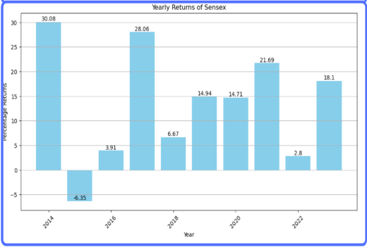
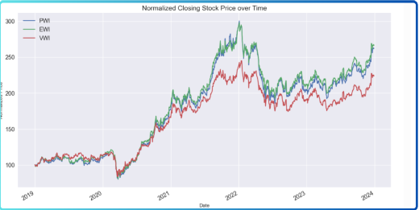

# Indian Stock Market Analysis

This Repo contains two projects related to **Indian Stock Market Analysis**. Here is a short description of these projects:

1. [SENSEX Analysis:](./SensexAnalysis.ipynb) This **SENSEX Analysis Project** is related to performing various financial analysis on the **SENSEX Index** using the data from a period of **10 years** from **2014-2024**.  
   
2. [IT Index Creation And Analysis:](./IndianITIndex.ipynb) In this project of **IT Index Creation And Analysis** we create an Index of Top 5 IT Stocks in Indian Stock Market and Analyse the created Index returns.  
   
